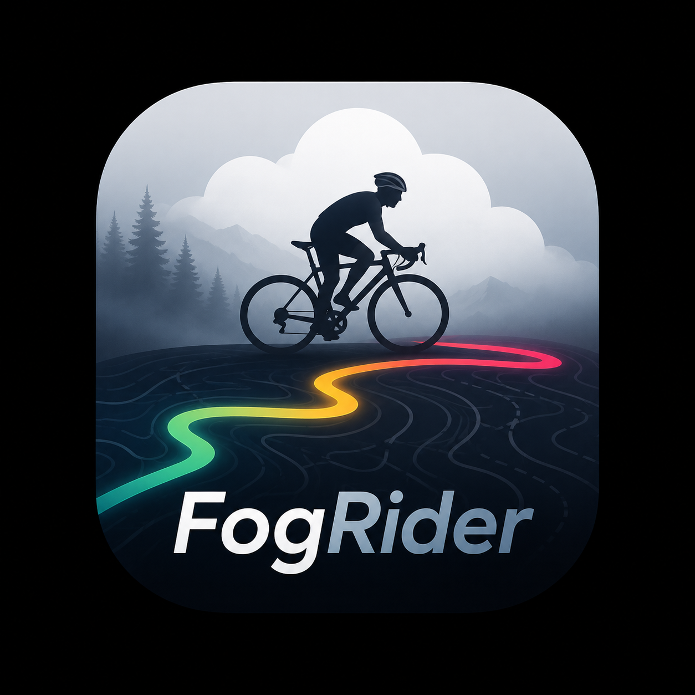
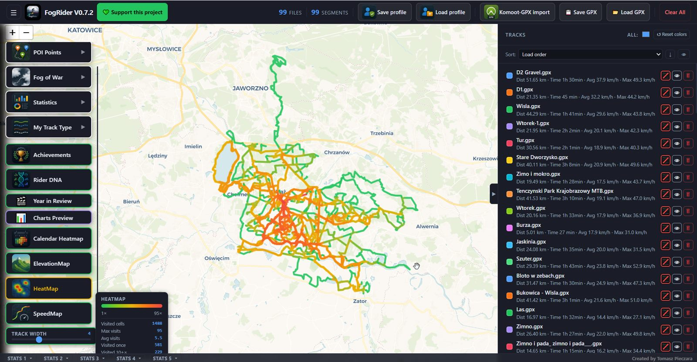
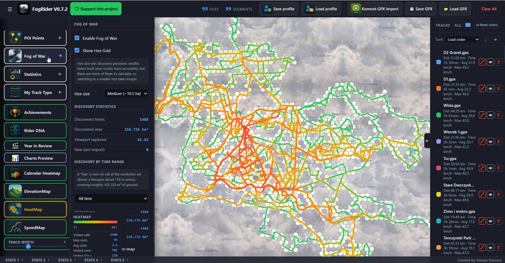
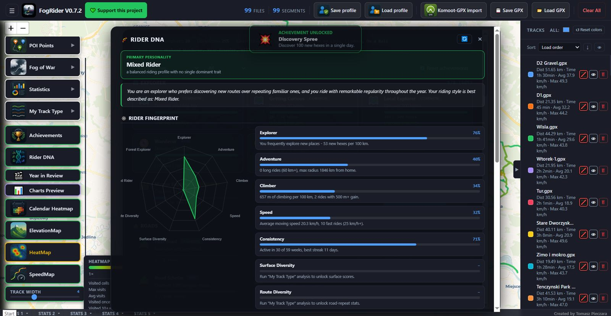
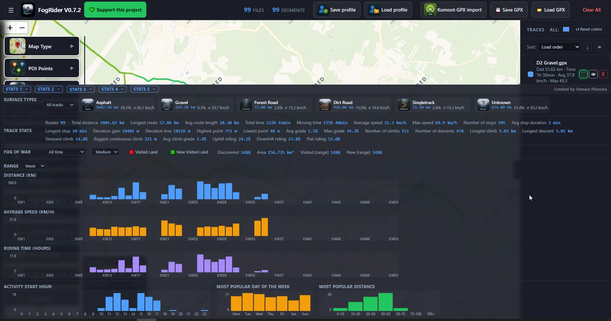
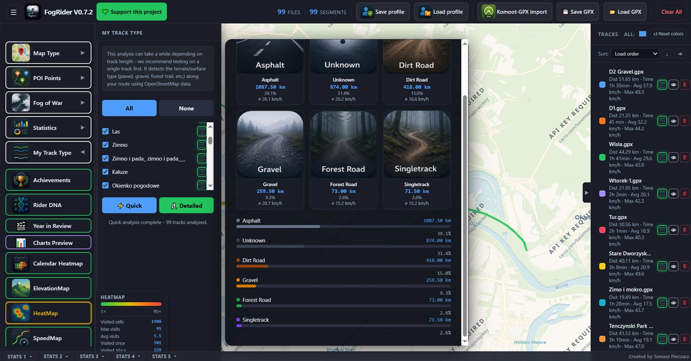
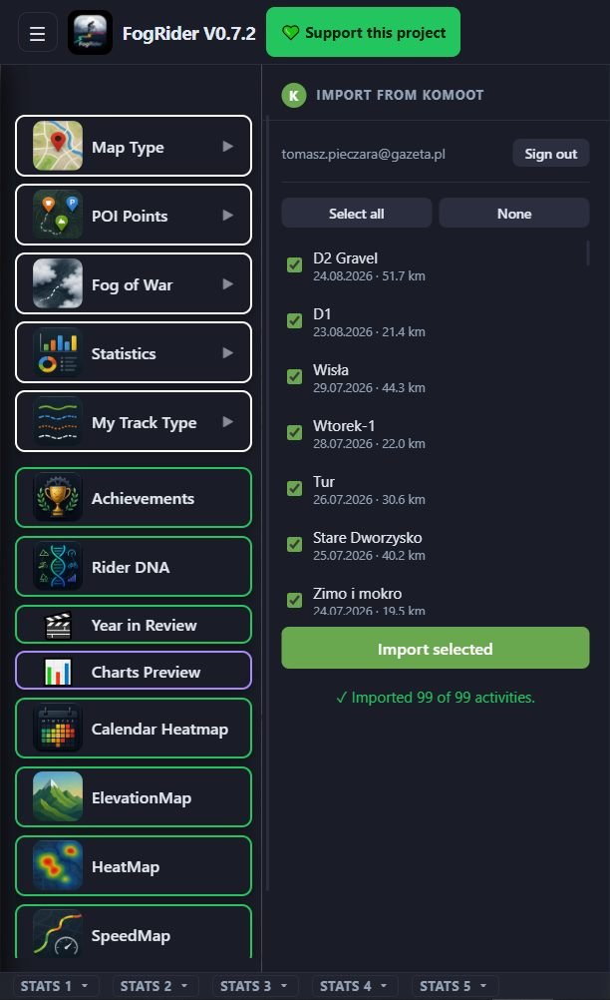

# FogRider

  

**FogRider** is a native Windows desktop app for GPS track visualization and analysis on an interactive map (Leaflet.js). Load GPX files, track discovered terrain, and analyze ridden routes for speed, elevation, and surface type.

  <strong><a href="https://spotrobotics.app/fogrider/">Home page</a></strong> · <a href="https://spotrobotics.app/support/">Support</a> · <a href="https://spotrobotics.app/fogrider/privacy.html">Privacy Policy</a>

## Download

[Download the installer](https://spotrobotics.app/fogrider/FogRider_0.7.3_x64-setup.exe) (`FogRider_0.7.3_x64-setup.exe`), or grab it from [Releases](../../releases). Run it, follow the setup wizard, launch FogRider from the Start menu.

## Screenshots

| | |
|---|---|
|  |  |
| **HeatMap** - colored by how often each area was visited | **Fog of War** - the map clears hex by hex as you ride |
|  |  |
| **Rider DNA** - a cycling personality profile from your riding history | **Bottom stats bar** - full ride statistics across five tabs |
|  |  |
| **My Track Type** - surface classification (asphalt, gravel, singletrack...) | **Komoot import** - pull activities straight from your Komoot account |

More screenshots on the [presentation page](https://spotrobotics.app/fogrider/).

## Features

- **GPX load and save** (*Load GPX* / *Save GPX* buttons) - import single `.gpx` files or whole `.zip` archives, either through the file dialog or by dragging them onto the app window. Export everything currently loaded back into one ZIP with a single click.
- **Profile save/load** (*Save profile* / *Load profile* buttons) - the entire set of loaded tracks, including per-track colors and thickness, is saved as a JSON file on disk via a native save/open dialog, so a whole session can be closed and reopened exactly as it was.
- **Fog of War** - the map starts out covered in fog and clears hex by hex, following the roads and trails you've actually ridden (H3 hexagonal grid). Tracks discovered area and hex count over time, lets you switch hex size for coarser or finer discovery precision, and highlights what's new since your last import.
- **SpeedMap** - colors every track on the map by riding pace, so faster and slower sections of a route are visible at a glance without opening the stats panel.
- **HeatMap** - shows how often a given area has been visited across all loaded tracks, from rarely-ridden roads to the routes you take constantly.
- **My Track Type** - classifies every ridden segment as asphalt, gravel, forest trail, singletrack, dirt road or unknown, based on OpenStreetMap/Overpass data, with a quick pass for fast results or a detailed pass for thorough per-segment analysis.
- **POI Points** - overlays categories like castles, churches, monuments, museums, viewpoints and hiking trails, plus WMS layers, straight from OpenStreetMap, each toggled on or off independently.
- **Komoot-GPX import** - log in with a Komoot account directly inside FogRider, browse recorded activities in a checklist, and import the ones you want in one batch - no manual GPX export needed.
- **Statistics** - distance, time, average/max speed, elevation gain, elevation and speed charts with axis scaling; plus stop count and duration, climb/descent count/length/grade, steepest and longest continuous climb, and percentage of route uphill/downhill/flat.
- **ElevationMap** - colors tracks on the map by segment steepness (grade), from flat to steep, so the hardest climbs and descents on a route stand out immediately.
- **Bottom stats bar** - a collapsible panel below the map with five sections: surface breakdown, global stats for all tracks, Fog of War (date-range filter, visited/new-terrain highlighting), activity charts (distance/speed/ride time by week, month, year), and riding-pattern histograms (start hour, day of week, distance).
- **Track list** - sort by date, track time, distance, average and max speed; set track line color and thickness per track; badges show whether a track has already been analyzed for surface type.
- **Track visibility on the map** - toggle a single track or all of them on/off without removing them from the list, useful for isolating one ride or decluttering a busy map.
- **Fog of War hexagon size selector** - adjust map-reveal precision across 4 H3 resolution levels, trading off detail against calculation time, remembered between sessions.
- **Achievements** - unlockable badges grouped into categories (exploration, roads, consistency and more), each with its own progress bar and an unlock notification the moment you earn it.
- **Rider DNA** - a cycling personality profile built from your loaded rides, plotted on a radar chart across traits like Explorer, Adventure, Climber, Speed and Consistency, each backed by the actual numbers behind it.
- **Year in Review** - a shareable yearly summary card: total distance, elevation gain, number of rides, longest ride, average speed and newly discovered terrain, exportable as a PNG.
- **Calendar Heatmap** - a GitHub-style contribution calendar of your riding activity, showing current and longest streaks, active vs. inactive days, and your most active weekday and month.

## Changelog

### V0.7.3 (2026-09-07)

- Minor internal packaging update

### V0.7.2 (2026-09-06)

- Removed the "Strava-GPX import" button from the toolbar (Strava GPX import stopped working after the switch to the desktop build)

### V0.7.1 (2026-08-09)

- FogRider is now a native Windows app (.exe installer, Tauri) - the browser version (opening `FogRider.html` directly) was a transitional variant and is no longer developed
- Fixed drag & drop of GPX/ZIP files onto the app window (it didn't work in the desktop version)
- External links (Strava, spotrobotics.app, map attributions) now open in the default browser instead of trying to navigate inside the app window
- The left column of buttons (map, layers, stats, achievements...) is now scrollable and no longer gets cut off on smaller windows; reduced spacing between buttons
- "Charts Preview" moved below "Year in Review" in the ordering
- Fixed main layout (100vh instead of 100dvh, which was computed incorrectly in the native window)
- The installer shows author info (Tomasz Pieczara, spotrobotics.app) and a clickable link on the finish page

### V0.70 (2026-07-10)

- ElevationMap: color tracks by segment steepness
- New bottom stats bar (collapsible, 5 sections): surface breakdown, global stats, Fog of War, activity charts, riding-pattern histograms
- Global stats: stop count/average/longest stop, climb/descent count/longest, steepest and longest continuous climb, average climb grade, percentage of route uphill/downhill/flat
- Activity charts by week (ISO), month and year: distance, average speed, ride time
- Riding-pattern histograms: activity start hour, most common day of week, most common distance
- Fog of War: rewritten hex generation (buffer of discovered hexes + neighbors instead of a grid over the whole viewport) - fixes "elliptical" coverage and speeds things up when the map is zoomed out
- Fog of War hexagon size selector (4 resolution levels), remembered between sessions
- "Analyzed" badges on the track list and in the My Track Type panel
- Various UI fixes: side button borders/sizes, top bar button alignment, track list width, fixed column widths on charts

### V0.62 (2026-07-03)

- Track list sorting: by date, track time, distance, average and max speed
- Axis scale (value + distance) on elevation and speed charts
- Smoothed speed chart (wider averaging window for the chart only, stats unchanged)
- Toggle track visibility on the map - individually and all at once
- Renamed the app file from `index.html` to `FogRider.html`

### V0.59 (2026-07-01)

- First release: GPX import/export (files and ZIP archives)
- Fog of War - map reveal along ridden tracks (H3 hexagonal grid)
- Speed map (Track Speed) and frequency map (Track Frequency)
- Surface analysis based on Overpass/OpenStreetMap data
- Tourist layers (POI, WMS)
- Import tracks from Komoot
- Track statistics, colors and line thickness
- Save/load profile as a JSON file on disk (instead of localStorage)
- Translated UI to English, per-track stats, build badge
